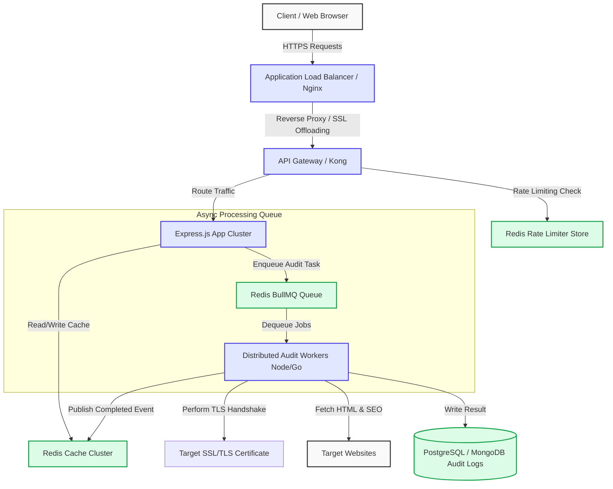

# Architecture Scaling & Design Document (Task B)

This document outlines the system architecture and scaling path for **Page Pulse**, details technology decisions, analyzes failure modes, defines the service level agreement (SLA), and specifies deployment/rollback pipelines.

---

## 1. High-Level Architecture Diagram

The diagram below represents the system architecture designed to scale seamlessly up to 10,000+ daily audits and handle over 500 concurrent requests without bottlenecks or system starvation.



---

## 2. Scaling Strategy

### 2.1. Handling 10,000 Audits / Day
At 10,000 audits per day, the average traffic is extremely low:
$$\text{Average Audits/Second} = \frac{10,000}{86,400} \approx 0.116\text{ req/sec}$$
Even under a peak distribution skew where $80\%$ of audits happen within a 4-hour window:
$$\text{Peak Audits/Second} = \frac{8,000}{14,400} \approx 0.55\text{ req/sec}$$
This volume can easily be handled by a single-core Node.js process. To ensure high availability, we deploy a **minimum of 2 instances** behind an Application Load Balancer across different availability zones (AZs).

### 2.2. Handling 500 Concurrent Requests (The Scaling Frontier)
When handling **500 concurrent HTTP audit requests**, the primary challenge is not the Express API server itself; it is the **unpredictable latency and resource exhaustion** of fetching third-party websites. 
If we execute 500 outgoing network requests synchronously on the API servers:
- **Socket Exhaustion**: Node's thread-pool/epoll limits and local outbound socket limits might be saturated.
- **Worker Starvation**: CPU usage spike from concurrent Cheerio HTML parsing.
- **Request Timeouts**: Third-party sites might take 5+ seconds to respond, blocking Express connections and causing gateway timeouts (HTTP 504).

#### The Mitigation Architecture:
1. **Asynchronous Decoupling**: 
   Incoming POST request is assigned a `requestId` and immediately enqueued into **Redis BullMQ** (returning `202 Accepted` with a job URL). The client polls the status or listens via a Web Socket connection.
2. **Worker Pool Isolation**:
   An independent scaling cluster of **Distributed Audit Workers** handles job consumption. The worker pool scales up dynamically based on queue depth (using Kubernetes HPA based on Custom Prometheus Metrics).
3. **Outbound IP Rotation & Proxies**:
   To prevent target websites from rate-limiting or blocking our servers, workers route outbound requests through a rotating proxy pool (e.g., Luminati/BrightData).
4. **Local DNS Caching**:
   Resolve target DNS records through local caching DNS servers (e.g., Unbound/Dnsmasq) to prevent DNS lookup timeouts at high scale.

---

## 3. Technology Decisions

| Technology | Selection | Alternative Considered | Rationale |
| :--- | :--- | :--- | :--- |
| **Runtime** | Node.js | Java (Spring Boot) / Go | Fast development, massive package ecosystem for HTML parsing (Cheerio), native asynchronous non-blocking I/O ideal for network-bound requests. |
| **Framework** | Express.js | Fastify | Extremely stable, industry-standard middlewares (`helmet`, `cors`, `compression`), large candidate knowledge base. |
| **HTTP Client** | Axios | Fetch API | Superior interceptor configuration, robust timeout handling, and easy custom HTTPS connection agents. |
| **HTML Parser** | Cheerio | Headless Chrome (Puppeteer) | **Design Choice:** Running Puppeteer consumes ~150MB RAM per page, causing memory crashes on free-tier containers. Cheerio parses the HTML string using CPU instructions in <50ms with a memory footprint of <2MB, allowing high scalability. |
| **In-Memory Cache** | Node Cache | Redis | Memory-based node cache for simple deployments. For clustered scale, we would shift to Redis to share cache states across stateless Express instances. |
| **Logger** | Pino | Winston | Ultra-low overhead, structured JSON logs standard for Kibana/Datadog parsing. |

---

## 4. Failure Mode Analysis & Mitigations

```
┌───────────────────────────┬──────────────────────────────────┬────────────────────────────────────────────────────────┐
│ Failure Mode              │ Impact                           │ Mitigation                                             │
├───────────────────────────┼──────────────────────────────────┼────────────────────────────────────────────────────────┤
│ Target Website Offline    │ Audit hang or network crash      │ Set short Axios connection timeouts (3s), capture     │
│                           │                                  │ errors, and return an audit status of "unreachable".   │
├───────────────────────────┼──────────────────────────────────┼────────────────────────────────────────────────────────┤
│ SSL Handshake Failures    │ Crash during cert check          │ Wrap TLS connection logic in a Promise with timeouts. │
│                           │                                  │ Catch handshakes with invalid chains and mark as untru.│
├───────────────────────────┼──────────────────────────────────┼────────────────────────────────────────────────────────┤
│ Destination Rate Limit    │ 429 status on audited site       │ Detect 429 headers and report as audit metadata, route │
│                           │                                  │ requests through rotating proxy pools.                 │
├───────────────────────────┼──────────────────────────────────┼────────────────────────────────────────────────────────┤
│ Cache Server Outage       │ Extreme backend latency          │ Implement circuit breakers (e.g., opossum) to bypass   │
│                           │                                  │ Redis and hit target sites directly until restored.    │
├───────────────────────────┼──────────────────────────────────┼────────────────────────────────────────────────────────┤
│ Memory Leak on Cheerio    │ Container restart                │ Clean up Cheerio memory references, enforce strict     │
│                           │                                  │ container max memory limits (e.g., cgroups).          │
└───────────────────────────┴──────────────────────────────────┴────────────────────────────────────────────────────────┘
```

---

## 5. SLA Definitions

We commit to the following Service Level Agreements for SDE requirements:

- **Availability**: $99.9\%$ monthly uptime (excluding planned maintenance).
- **Latency Target**:
  - Cached audits: $\le 150\text{ms}$ at p95.
  - Live audits: $\le 2.0\text{s}$ at p95 (bounded by target website speeds).
- **Graceful Error Handling**: $100\%$ of internal failures must return a structured JSON response matching the error contract, including the `X-Request-ID` correlation header.

---

## 6. Monitoring & Alerting

### 6.1. Metrics Collection
We expose an endpoint `/metrics` for **Prometheus** to scrape:
- `http_requests_total`: Total requests count by method, endpoint, and status code.
- `audit_concurrency_active`: Gauging the current active audits.
- `audit_duration_seconds`: Histogram of audit latency.
- `cache_hit_ratio`: Percentage of requests served from cache.

### 6.2. Alerting Rules
- **Error Spikes**: Trigger PagerDuty/Slack alert if HTTP 5xx responses exceed $2\%$ of total requests within a 5-minute window.
- **Latency Degradation**: Alert if p95 response time for cached assets exceeds $500\text{ms}$.
- **Rate Limit Trigger**: Alert if rate-limiting blocks more than $5\%$ of total traffic (potential DDoS warning).

---

## 7. Rollback & Deployment Strategy

We employ a **Blue-Green Deployment** pipeline managed by Kubernetes or AWS ECS:

1. **Continuous Integration**: GitHub Actions validates tests and builds the new Docker image, tagging it with the Git commit SHA.
2. **Staging Deployment**: Deploy to the Green environment. Run integration tests against staging.
3. **Traffic Switch**: Route $10\%$ of production traffic to Green (Canary). If zero errors are reported over 10 minutes, shift $100\%$ of traffic via DNS/Load Balancer.
4. **Instant Rollback**: If error rates spike, instantly switch the load balancer routing target back to the Blue (previous stable) version. Blue containers remain active for 1 hour post-deployment to ensure immediate rollback capability.
